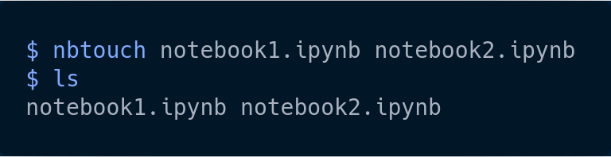
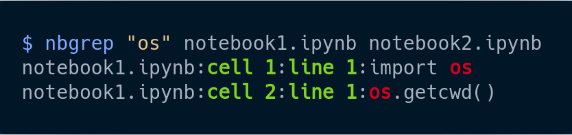
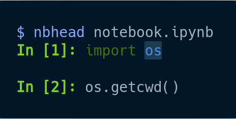
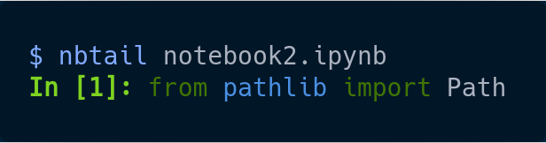
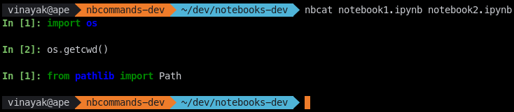

# nbcommands

nbcommands bring the goodness of Unix commands to Jupyter notebooks.

## Installation

You can simply use pip to install nbcommands:

<pre>
$ pip install nbcommands
</pre>

## Usage

nbcommands gives you the following commands to interact with your Jupyter notebooks.

- `nbtouch`: Update the access and modification times of each Jupyter notebook to the current time.

    <pre>
    $ nbtouch notebook1.ipynb notebook2.ipynb</pre>
    

- `nbgrep`: Search for a pattern in Jupyter notebooks.

    <pre>
    $ nbgrep "os" notebook.ipynb</pre>
    

- `nbhead`: Print the first 5 cells of a Jupyter notebook to standard output.

    <pre>
    $ nbhead notebook.ipynb</pre>
    

    Note: You can also specify the number of cells you want to print using the `-n` option.
    <pre>
    $ nbhead -n 10 notebook.ipynb</pre>

- `nbtail`: Print the last 5 cells of a Jupyter notebook to standard output.

    <pre>
    $ nbtail notebook.ipynb</pre>
    

    Note: You can also specify the number of cells you want to print using the `-n` option.
    <pre>
    $ nbtail -n 10 notebook.ipynb</pre>

- `nbcat`: Concatenate Jupyter notebooks to standard output.

    <pre>
    $ nbcat notebook.ipynb notebook2.ipynb</pre>
    

    Note: You can create a new notebook by concatenating multiple notebooks using the `-o` option.
    <pre>
    $ nbcat notebook1.ipynb notebook2.ipynb -o notebook3.ipynb</pre>

Future enhancements:

- `nbblack`: Blacken each cell in Jupyter notebooks.
- `nbstrip`: Strip outputs from Jupyter notebooks.
- `nbecho`: Add a code cell to a Jupyter notebook.
- `nbdiff`: Find the diff between two Jupyter notebooks.
- `nbtime`: Run and time a Jupyter notebook.
- `nbwc`: Print word count for a Jupyter notebook.

## Versioning

nbcommands uses [Semantic Versioning](https://semver.org/). For the available versions, see the tags on this repository.

## License

This project is licensed under the Apache License, see the [LICENSE](https://github.com/vinayak-mehta/nbcommands/blob/master/LICENSE) file for details.
